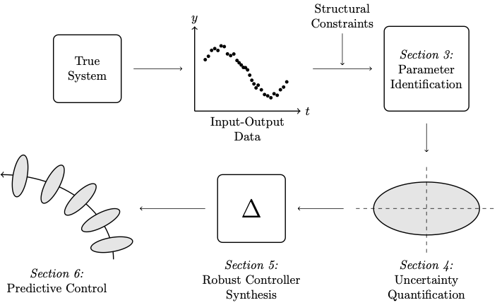

# From Data to Predictive Control: A Framework for Stochastic Linear Systems with Output Measurements
The code accompanying our paper that reproduces the results.

**Authors:** Haldun Balim, Andrea Carron, Melanie N. Zeilinger, and Johannes Köhler

## Setup 
From the base directory of this repository, install dependencies with:
~~~~
pip install -r requirements.txt
~~~~
Then, install this package with:
~~~~
python setup.py build  
pip install .
~~~~

## Functionality Overview

  
   
  <em>Illustration of the proposed D2PC framework.</em>

The provided code implements our proposed framework Data to Predictive Control (D2PC), which consists of:
1. An identificaiton scheme based on Expectation-Maximization algorithm, which allows for pre-defined structural constraints to be integrated, see:
~~~~
d2pc/id_em/str_em_runner.py
~~~~
2. An uncertainty quantification method for the parameter estimates, see:
~~~~
d2pc/id_em/unc_quant.py
~~~~
3. A robust controller synthesis strategy that minimize $\mathcal{H}_2$-norm of the closed-loop system, see:
~~~~
d2pc/control/dynof_synth.py
~~~~
4. A predictive controller that ensures chance-constraint satisfaction and recursive feasbility. \
    a. For offline phase, see:
    ~~~~
    d2pc/control/offline.py
    ~~~~
    b. For online phase, see:
    ~~~~
    d2pc/control/rsmpc.py
    ~~~~

## Reproducing Results From the Paper
Implementation of D2PC framework on our numerical benchmark example ($10$-dimensional chain mass system) can be found in scripts folder. In the following we detail how to replicate the results and generate figures in the paper. First, run the following scripts to execute the offline phase of the algorithm:
~~~~
python scripts/spring_mass_offline.py
~~~~
This will create a time-stamped directory in the outputs directory that contains the offline phase results. Additionally, run the following scripts to compute the offline phase of the algorithm for fully-parameterized and ARX structured systems. These will also create pickled files in the corresponding time-stamped directory:
~~~~
python scripts/spring_mass_offline_lti.py
python scripts/spring_mass_offline_arx.py
~~~~
Then, run the following scripts to create figures:
~~~~
python scripts/generate_control_figs.py
python scripts/generate_pred_err_fig.py
python scripts/generate_dynof_fig.py
python scripts/sddpc_compare.py
~~~~
The figures will be saved in the corresponding time-stamped directory.

## Citation
If you use this code in your research, please cite the accompanying paper: 
Balim, H., Carron, A., Zeilinger, M. N., & Köhler, J. (2024). From Data to Predictive Control: A Framework for Stochastic Linear Systems with Output Measurements. 